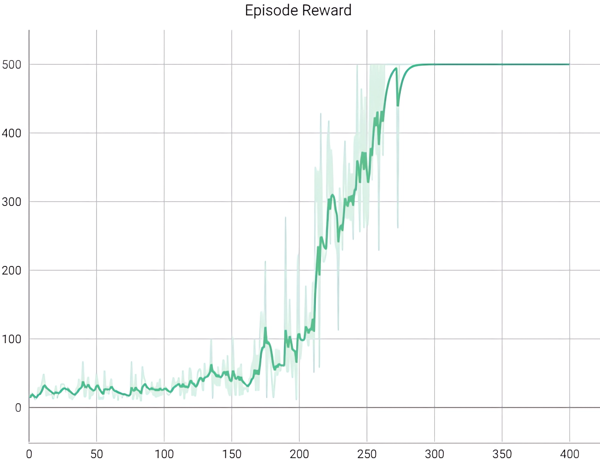

## Description
This repository contains the PyTorch implementation of the REINFORCE algorithm to solve the [Cart Pole V1](https://gymnasium.farama.org/environments/classic_control/cart_pole/#) environment provided by the Gymnasium library. In this environment, a pendulum is placed upright on a cart, and the goal is to balance the pole by applying actions (forces) in the left and right direction on the cart.

## REINFORCE Algorithm
REINFORCE is a policy gradient algorithm to discover a good policy that maximizes cumulative discounted rewards. In simple terms, the core idea of the algorithm is to learn the good policy by increasing the likelihood of selecting actions with positive returns while decreasing the probability of choosing actions with negative returns using neural network function approximation. REINFORCE uses gradient ascent optimization which facilitates the learning of policies by modifying the parameters toward higher expected rewards. Hence, it is useful in policy optimization, allowing an agent to learn from its own mistakes.

## Requirements
The code is implemented in Python 3.8.10 and has been tested on Windows 10 without encountering any issues. Below are the non-standard libraries and their corresponding versions used in writing the code:
<pre>
gymnasium==0.29.1
numpy==1.22.0
torch==2.0.1+cu118
</pre>

**Note:** This repository uses the latest version of Gymnasium for compatibility and optimization purposes. This code does not utilize any deprecated or old versions of the Gym library.

## Usage
The network final weights are pre-saved in the root directory `./final_weights.pt`. There is no need to initiate training from the beginning for testing the code. Upon executing the code, the weights will automatically be loaded, allowing seamless rendering and testing. Have fun in the environment!

## Showcase
You can view the training procedure through the following GIFs, demonstrating the learned process across episodes.

  
  
  

### Results
Here is a summary of the training outcome over 400 episodes. The plot depicts the raw rewards obtained during training.

  

## Beyond Pendulum Balancing
Explore my solutions for various environments within the Gymnasium library, each presenting captivating challenges that showcase the exciting applications of deep reinforcement learning techniques. Some of these solved environments include:

###### Toy Text Environments:
1. [Frozen Lake v1](https://github.com/MehdiShahbazi/DQN-Frozenlake-Gymnasium) &#8594; Solved with DQN algorithm
2. [Cliff Walking v0](https://github.com/MehdiShahbazi/DQN-Cliff-Walking-Gymnasium) &#8594; Solved with DQN algorithm

###### Classic Control Environments:
1. [Mountain Car v0](https://github.com/MehdiShahbazi/DQN-Mountain-Car-Gymnasium) &#8594; Solved with DQN algorithm